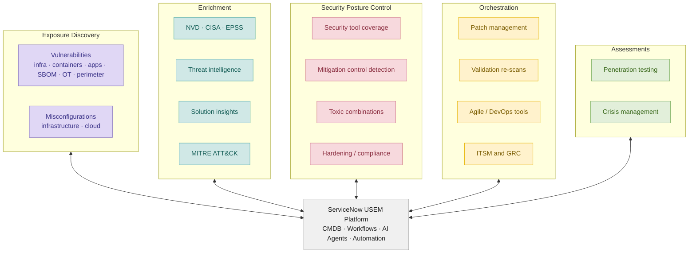
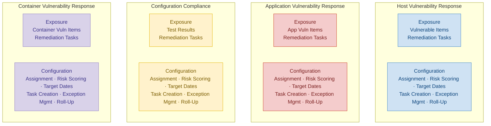
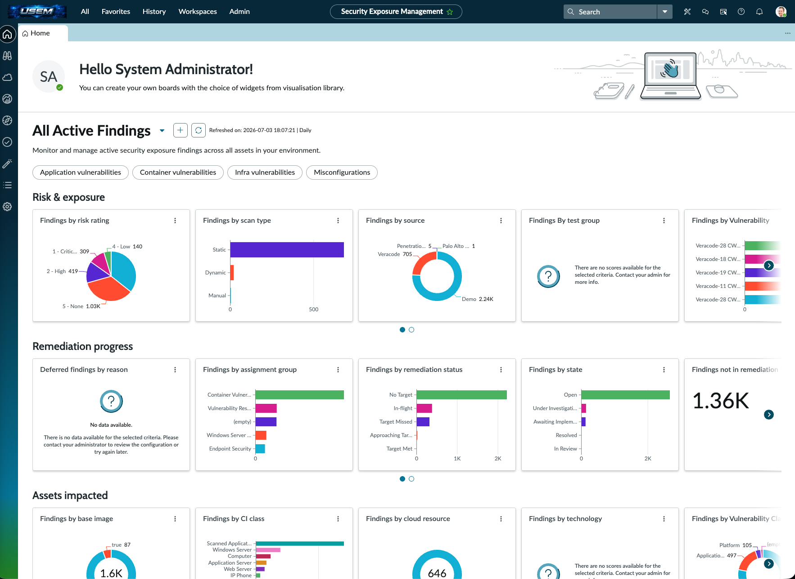
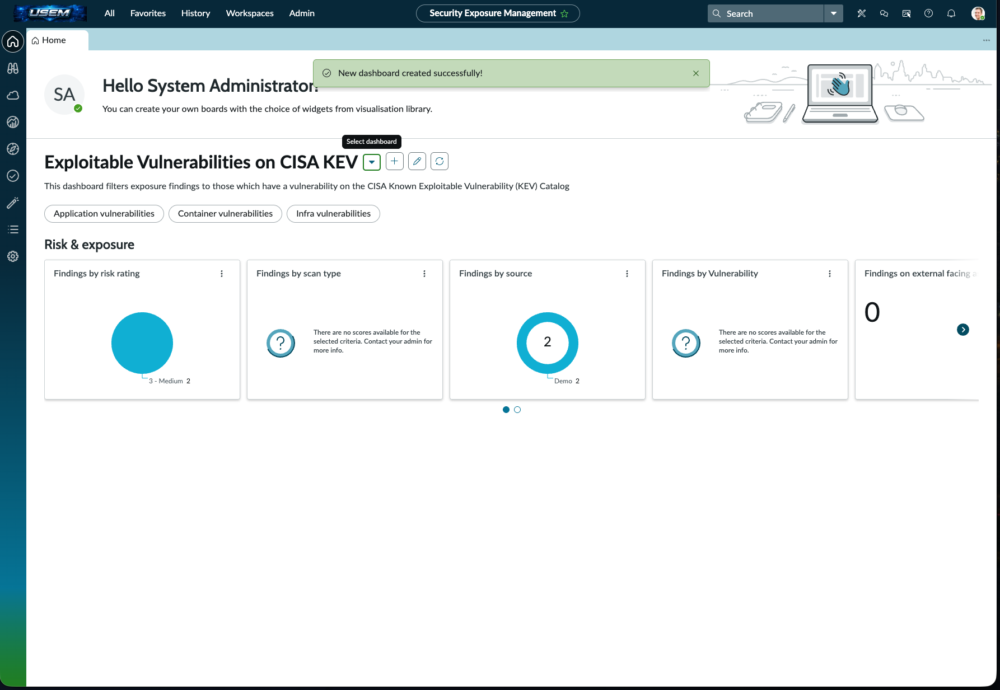
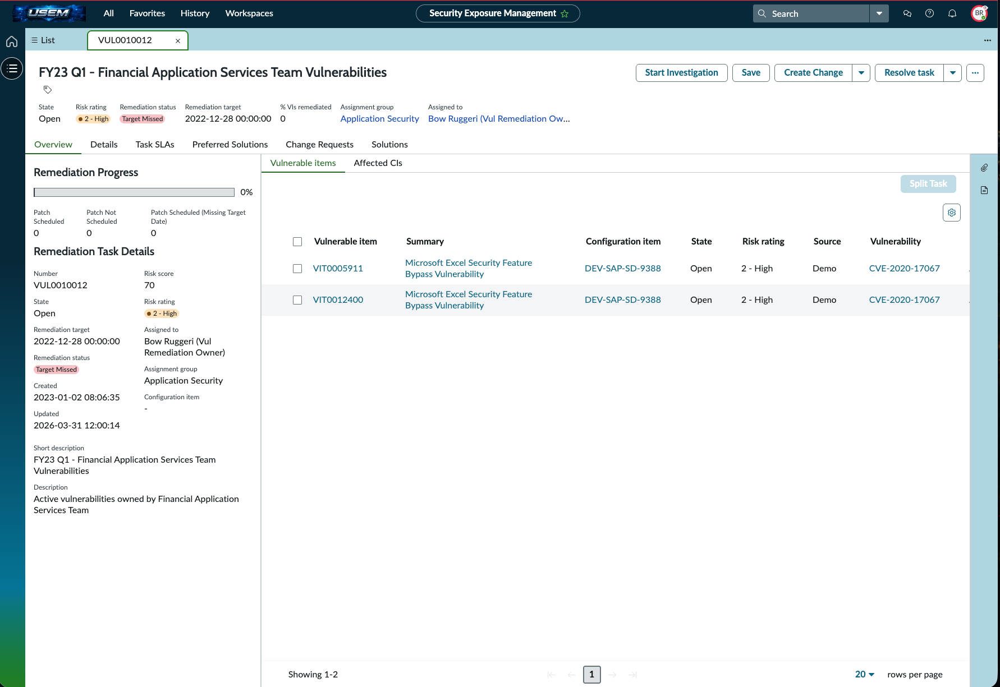
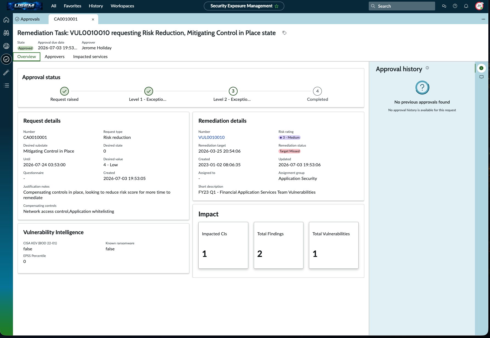

# ServiceNow Unified Security Exposure Management (USEM) Bootcamp

Hands-on lab covering the next generation of ServiceNow Vulnerability Response (VR), reworked into a single unified exposure management experience.

**Format:** On-demand SecOps training + guided lab

**Course:** [Unified Security Exposure Management (USEM) Bootcamp — ServiceNow University](https://learning.servicenow.com/lxp/en/security-operations/unified-security-exposure-management-usem-bootcamp?course_id=3024094747173e1009e1ce44846d43d1&id=learning_course_prev)

**Completed:** *July 3, 2026*

---

## Overview

USEM is ServiceNow's redesign of Vulnerability Response into a single platform for managing security exposures, not just host vulnerabilities but application, container, and configuration compliance findings under one roof. The course is aimed at implementers learning to explore and stand up this next generation of VR.

This bootcamp walked through the platform from four operational perspectives inside the Security Exposure Management (SEM) Workspace: **Security Analyst, Remediation Owner, Approver, and USEM Administrator**. This README focuses on what I learned and what I configured in each role.

---

## What I Learned

### 1. Managing security exposures is broader than "scanning for CVEs"

ServiceNow frames exposure management as a lifecycle that pulls together several inputs and workflows around a central platform:

- **Exposure Discovery:** vulnerabilities and misconfigurations across infrastructure, containers, applications, SBOM, OT, perimeter, and cloud (ingested from leading third-party scanners).
- **Enrichment:** context from NVD, CISA KEV, EPSS, threat intelligence, and MITRE ATT&CK to prioritize what actually matters.
- **Security Posture Control:** tool coverage, mitigation/control detection, toxic combinations, and hardening/compliance.
- **Orchestration:** patch management, validation re-scans, and hand-offs into ITSM/Agile/DevOps tooling.
- **Assessments:** penetration testing and crisis management.

**Takeaway:** effective vulnerability/exposure management is a data normalization and prioritization problem as much as a detection problem. Enrichment sources (KEV, EPSS) are what turn a raw scanner dump into a ranked worklist.

### 2. The problem USEM solves: four disconnected response tracks

Before USEM, VR handled each exposure type as its own silo (Host VR, Application VR, Configuration Compliance, and Container VR), and *each* maintained its own duplicated configuration stack (Assignment, Risk Scoring, Target Dates, Task Creation, Exception Management, Roll-Up).

That created four recurring pain points:

1. No single place to **report across all exposure types**.
2. Inconsistent handling of exposures with **public/known exploits**.
3. Fragmented **access to exposure data** across assets.
4. No **feature parity** across VR, AVR, CC, and CVR.

### 3. How USEM fixes it: decouple configuration, unify the experience

USEM **decouples configuration from the individual finding tables**. Instead of four copies of every rule, there's now:

- A single **USEM Configuration Framework** where each configuration type (Assignment, Risk Scoring, Target Dates, Task Creation, Exception Mgmt, Roll-Up) applies across all four finding types: VIT, AVIT, CTR, CVIT.
- A single **Unified Exposure Experience** (SEM Workspace) for workspace/aggregate reporting across every exposure type.
- A **USEM Migration Toolkit / Migration Assistant** for existing VR customers upgrading in place.

**Takeaway:** the win is *one place to manage all configurations* and *one place to view and report on all exposure types*. This is a classic platform consolidation pattern: reduce duplicated config surface area to cut drift, technical debt, and reporting blind spots.

*[Screenshot: "Vulnerability Response Evolved with USEM" (Unified Experience) diagram]*

---

## Hands-On Lab: Four Personas

The lab used a pre-loaded instance with demo exposure data. I worked through four personas in the SEM Workspace:

1. **[Security Analyst](#section-1-security-analyst)**: exploring and reporting on exposure findings
2. **[Remediation Owner](#section-2-remediation-owner)**: working assigned findings through the remediation lifecycle
3. **[Approver](#section-3-approver)**: reviewing and dispositioning exception requests
4. **[USEM Administrator](#section-4-usem-administrator)**: configuring the unified framework (assignment, scoring, remediation targets, and reporting)

### Section 1: Security Analyst

Exploring and reporting on exposure findings.

**What I did / configured:**
- Navigated the SEM Workspace landing page showing all exposure findings in one view: Host VR (VITs), Application VR (AVITs), Container VR (CVITs), and Configuration Compliance (CTRs).
- Applied built-in toggle filters (Container vulnerabilities, Infra vulnerabilities) and a top-level **Exploitable** filter (`vulnerability.exploit = true`).
- **Built a new shared dashboard:** *"Exploitable Vulnerabilities on CISA KEV"*
  - Applies to: Application, Container, and Infra vulnerabilities
  - Condition: dot-walked `Vulnerability > CISA KEV (BOD 22-01)`
  - Enabled daily refresh; selected visualizations across Risk & Exposure, Remediation Progress, and Assets Impacted
- Reviewed the **Cloud Exposure View** (unifies host, container, and cloud misconfigurations by resource type, reference only).

**Key insight:** new SEM dashboards automatically append `Active = True` to conditions and are stored in `sn_sec_sem_dashboard`.

**SEM Workspace landing page & Custom CISA KEV dashboard creation**

### Section 2: Remediation Owner

Working assigned findings through the remediation lifecycle.

**What I did / configured:**
- Granted remediation roles to the *Windows Server support* user group: `sn_vul.remediation_owner`, `sn_vulc.remediation_owner`, `sn_vul_container.remediation_owner`.
- Impersonated a Remediation Owner to see the workspace scoped to *their* group's assigned findings.
- Filtered the Findings tab (Infra Vulnerabilities) and the Remediation Tasks list by **Record Type** (Host Vulnerable Items).
- Progressed a Remediation Task through state changes: **Start Investigation → Awaiting Implementation**, then supplied a **Remediation Plan Commitment Date** and **Remediation Plan** (a newer feature for capturing remediation intent).
- Submitted an **exception request**: reason *Mitigating Control in Place*, *Request for Risk Reduction*, desired rating *4 – Low*, with compensating controls and justification.

**Key insight:** for *new* USEM installs the `itil` role no longer inherits the remediation owner roles; those must be assigned to remediation team groups. Upgrades keep the old inheritance.

**Remediation Task workflow: Assessed remediation tasks and initiated exception request**

### Section 3: Approver

Reviewing and dispositioning exception requests.

**What I did / configured:**
- Impersonated an Approval user and opened the Approvals view in the SEM Workspace.
- Reviewed the *Today's approvals* / *Pending approvals* widgets and opened the risk-reduction exception raised in Section 2.
- Reviewed the full risk context (current vs. desired rating, compensating controls, justification, approval chain) and actioned the **approve / reject** decision.

**Key insight:** exception approvals can be routed by scenario (false positive, deferral, risk reduction) and each flavor can carry its own tailored questionnaire for the requesting team.

**Approval record + Approval history**

### Section 4: USEM Administrator

Configuring the unified framework, the core of the hands-on work. Everything below lives in one consolidated Administration surface rather than the scattered legacy VR modules. I first reviewed the enabled exposure-discovery and enrichment integrations (**4.1–4.2**: NVD, CISA KEV, First.org EPSS, and others) and their run health, then built or tuned the configurations below.

| # | Config built / changed | Key settings | Why it matters |
|---|---|---|---|
| 4.3 | Normalized Severity Map (*Tenable.was*) | Override vendor "Info" (`5 – None`) → `4 – Low` | Normalizes vendor severities onto one scale |
| 4.4 | Classification Rule: *Linux Resources* | Vuln Entry where `Summary contains` redhat / rhel / suse / fedora / centos / ubuntu / debian / jboss → Classification *Platform*, type *Linux Resources* | Normalizes messy vuln data for clean downstream queries |
| 4.5 | Assignment Rule: *Linux VIT Assignment Rule* | VIT where `Vulnerability > Classification type IS Linux Resources` → assign *Unix Support Group* | Auto-routes Linux findings; reuses the 4.4 classification |
| 4.6 | Risk Calculator: tuned *Default Risk Rule* | Modified Severity 80→70%, Exploit Exists 20%, Exploit attack vector +10% (=100%); sample preview score **83 (2 – High)** | Weighted, exploit-aware prioritization |
| 4.7 | Remediation Target Rule: *Critical Risk – 7 Days* | All 4 exposure types; `Risk Rating IS 1 – Critical` → 7 days from Opened; notify 3 days prior; recalc from risk-change date | Consistent SLAs across every exposure type |
| 4.8 | Visualization: *Top Exception Requestors* | Remediation Progress · Horizontal bar · order 5; Infra/Container/App; group by *Deferred by*; `State IS Deferred` | Cross-exposure exception reporting |

A few things worth calling out from this section:

- **Classification rules feed assignment rules.** The clean *Linux Resources* classification from 4.4 is reused directly as the 4.5 assignment condition, so routing keys off normalized data instead of brittle keyword matching.
- **Weighted risk inputs must total exactly 100%**, or the score preview is disabled, which is what forced the 80→70% plus 10% rebalance in 4.6.
- **Cross-exposure reporting works** because USEM visualizations read normalized fields shared across the VIT / CVIT / AVIT / CTR finding tables plus the VR Aggregate Report Framework.

---

## Skills Demonstrated

- Vulnerability & exposure management workflow (discovery → enrichment → prioritization → remediation → exception handling)
- Risk-based prioritization using enrichment sources (CISA KEV, EPSS) and weighted risk scoring
- Data normalization via classification rules and severity mapping
- Automated assignment/routing and SLA (remediation target) configuration
- Exception, risk-acceptance, and approval workflows
- Reporting and dashboard/visualization design across multiple finding types
- ServiceNow SecOps platform administration and role-based access

---

## Proof of Completion

Screenshots from working each persona are included in this repo:

| Persona | Evidence |
|---|---|
| Security Analyst | *[link]* |
| Remediation Owner | *[link]* |
| Approver | *[link]* |
| USEM Administrator | *[link]* |

---

## Notes

- The lab also covered **Section 5 – VR-to-USEM upgrade** (Migration Assistant, customization review, technical-debt considerations). That's an install/migration exercise and is intentionally out of scope for this write-up, which focuses on the operational and configuration work in Sections 1–4.
- *Glossary:* **VIT** Host Vulnerable Item · **AVIT** Application Vulnerable Item · **CVIT** Container Vulnerable Item · **CTR** Configuration Test Result · **SEM** Security Exposure Management · **KEV** Known Exploited Vulnerabilities · **EPSS** Exploit Prediction Scoring System.
